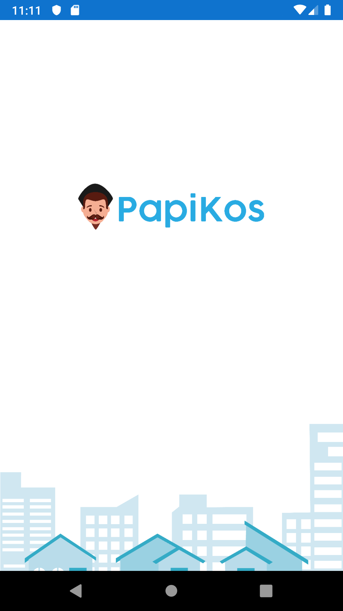

<h1 align='center'>Papikos <br>Rooms Booking Application</h1>

<p align='center'>
    
</p>

<br>
<br>

## Introduction
[](https://facebook.github.io/react-native/)
[](https://firebase.google.com/?gclid=EAIaIQobChMI2qeqx_3C4wIVTiUrCh0i0QGfEAAYASAAEgIPNfD_BwE)
[](https://github.com/react-native-community/react-native-maps)


<p align='justify'>Papikos is a Rooms Booking Application connecting rooms owner (Partner) with rooms seeker (User) through chats and map/location feature. User also can choose rooms based on rooms location, in this app there's search location and city list to help User to achive the purpose. User also can booking the room and check the payment status within the app. On Partner side, Partner can add a room and its detail. </p>

## Contributors
1. <a href="https://github.com/najibrizqy136">Najibullah Rizqy F</a>
2. <a href="https://github.com/mamenesia">Dedy Prasetyo H.</a>
3. <a href="https://github.com/fajrulaulia">Fajrul Aulia</a>
4. <a href="https://github.com/ahmmadmaliki">Ahmmad Maliki</a>
5. <a href="https://github.com/tejojr">Ammar Annajih Pasifiky</a>

## Link to Backend API
You can visit Papikos backend API on github [`here`](https://github.com/mamenesia/PapiKos-API)

## How to Install
1. Download this Project or you can type ``` git clone https://github.com/najibrizqy136/Papikos ```
2. Open app's directory in CMD or Terminal
3. Type ` npm install ` or ` yarn install `
4. Type ` react-native run-android `

## Download the APK
You can Download the APK [`here`]()


## Screenshot from the App
<p align='center'>
  <span>
      <image width="200" src="./screenshot/splash.png" />
      <image width="200" src="./screenshot/welcome.png" />
      <image width="200" src="./screenshot/login_user.png" />
      <image width="200" src="./screenshot/register_user.png" />
      
  </span>
</p>
<p align='center'>
  <span>
      <image width="200" src="./screenshot/home.png" />
      <image width="200" src="./screenshot/friendlist.png" />
      <image width="200" src="./screenshot/chatroom.png" />
      
  </span>
</p>
<p align='center'>
  <span>
      <image width="200" src="./screenshot/friend-profile.png" />
      <image width="200" src="./screenshot/user-profile.png" />      
  </span>
</p>